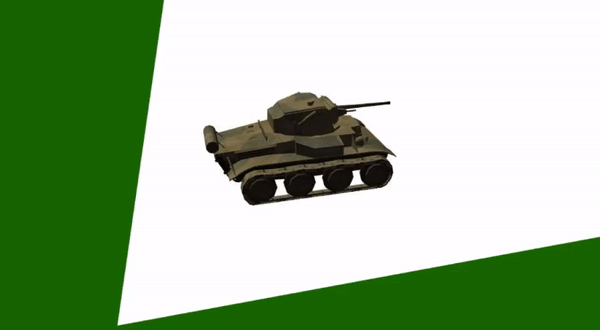
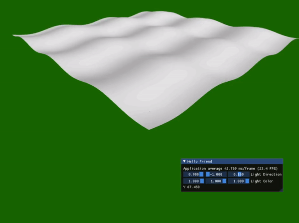
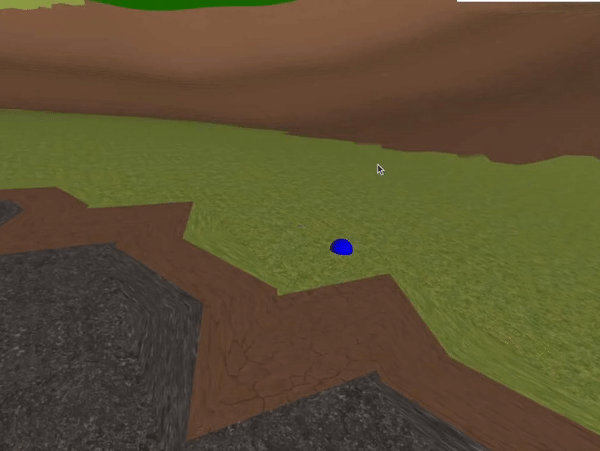

## Overview

| Duration  | Platform | Team size | Language |Tools|
|:-------------|:-------------:|--------------:|--------------:|
| 8 weeks  | Linux(Raspberry Pi)   |Solo    |C++ |Visual Studio|

