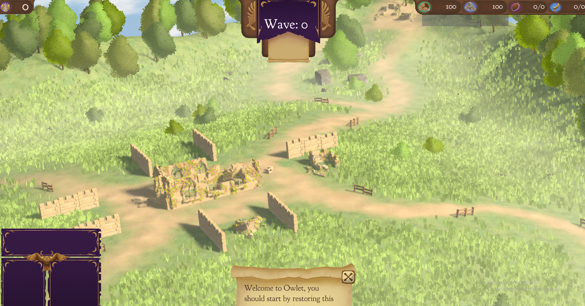
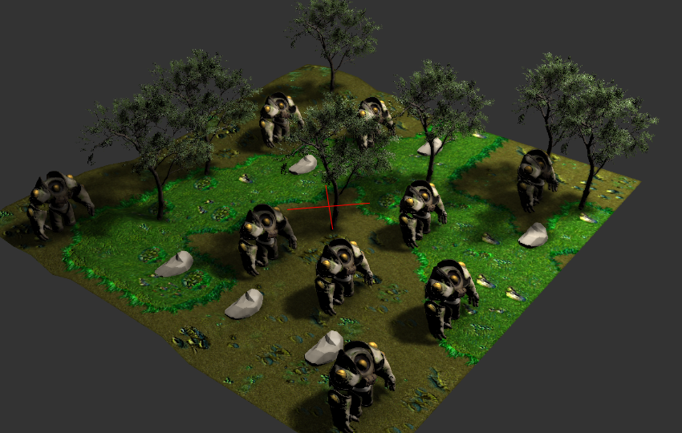
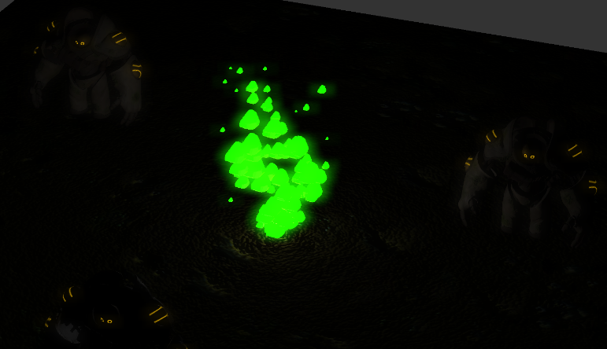
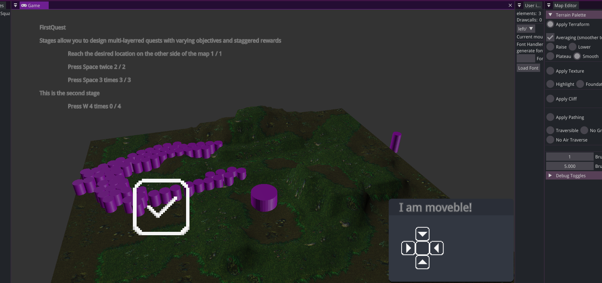
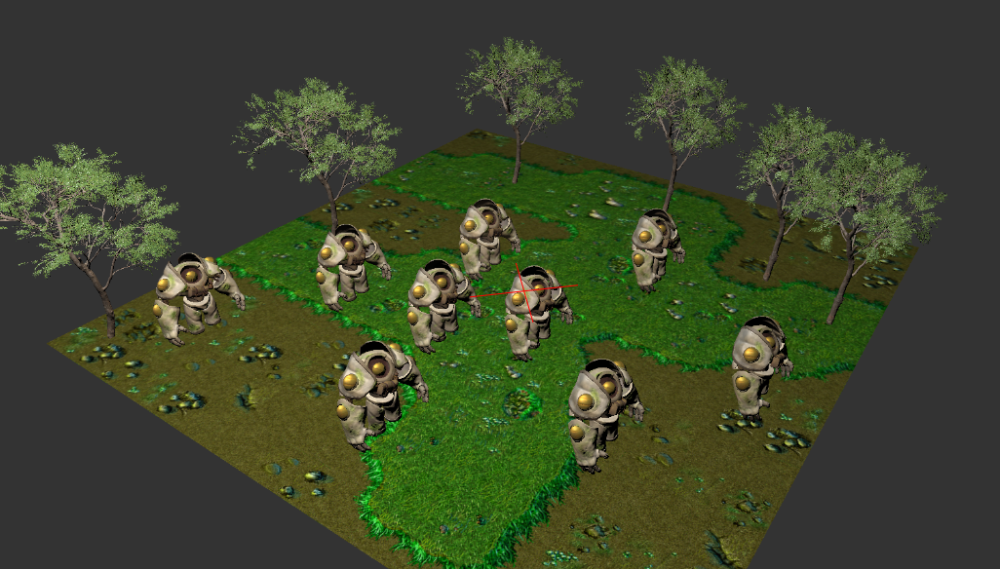

## PEPI Renderer

### Ray-Traced Shadows

I made use of DXR to trace shadow rays, allowing for soft shadows.

### Bloom

I made use of compute shaders to create the bloom effect for colors with emissive values.

### Blended Skeletal Animations

The renderer allows smoothly blending between multiple skeletal animations

### UI System Porting

The UI system was initially implemented in OpenGL(by another programmer in our team). I ported this system to DX12, keeping all its functionality intact.

### Mesh Instancing

The renderer makes use of instanced rendering, allowing to renderer all the identical meshes in one single draw call.

### Compatibility with Editor Tools

The renderer can be used to render in real time all the changes made by the editor, such as editing lights, modifying meshes and materials and the terrain editor.

### Indexed Materials

This allows instanced rendering while still being able to have different materials on identical meshes.

### Mip-Mapping

Made use of compute shaders to generate mip maps for all the textures.

### Steam-Deck Support

For the first 8 weeks of the project, the engine could be run on a steamdeck. We eventually abandoned it, as the project requirements did not ask for multiple platform support of the engine anymore.

