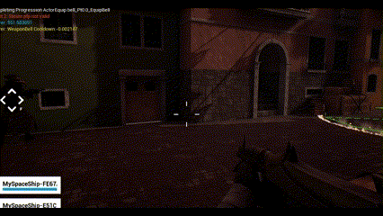
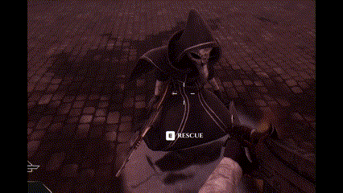
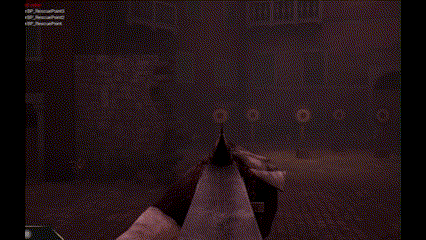
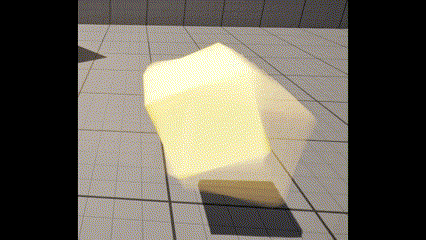

## Umbra Mortis

Throughout this project I learned a bunch of new things, such as developing multiplayer games adn using networking concepts, using the Scene View Extension to add custom shader passes, or using Niagara. 

### Visual Effects

Since our team lacked a VFX artist, I took upon this role, applying my shader experience to using Niagara. I would regularly receive feedback from the Visual Artists in our team, ensuring that the effects are cohesive with the rest of the game. 

#### Ammo Box 

#### Bell Aura 

#### Disease Visualization

#### Key Pickup

#### Bell AOE Visualization

#### Dissolving Effect

#### Canals Water

The water is reactive to the environment, creating waves around objects that have contact with it.

#### THE STINKY FISH (my proudest achievement so far)

### Gameplay

#### Lobby Practice Targets

#### Headshot Hitmarkers

Working on this lead to discovery that the shooting was not reliable and accurate for all the players in a session, which we eventually fixed.

#### Teammate Outline Post Process

#### Downed Post Process

### Networking

The networking aspect of the game did make the development a little bit more difficult. Even for the visual elements of the game, some required replication of different parameters.

### Research 

In the early stages of the project, when the vision was not yet clear, I decided to experiment with the Scene View Extension class in Unreal Engine 5. This allows injecting custom shader passes at different stages of the rendering pipeline. This allowed me to create some effects that we did not end up using in the game, but are worth showing. 

I made use of a depth stencil buffer to create a ghosting effect and a scanning effect.

The research I did with those has lead me to start working on this project: 


